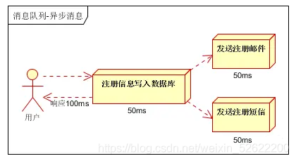

<!--
 * @Author: WeiShan
 * @Date: 2023-07-17 11:27:08
 * @LastEditors: WeiShan
 * @LastEditTime: 2023-07-17 11:27:21
 * @FilePath: \knowledge-book\pages\backend\MESSAGE-QUEUE.md
 * @Description: 
 * 
 * Copyright (c) 2023 by WeiShan/xls, All Rights Reserved. 
-->
# 消息队列-message queue #

## 一、消息队列概述 ##

消息队列中间件是**分布式系统**中重要的组件，主要解决**应用解耦**，**异步消息**，**流量削锋**等问题，实现**高性能，高可用，可伸缩**和最终一致性架构。目前使用较多的消息队列有ActiveMQ，RabbitMQ，ZeroMQ，Kafka，MetaMQ，RocketMQ

## 二、消息队列的应用场景 ##

**2.1异步处理**

场景说明：用户注册后，需要发注册邮件和注册短信。传统的做法有两种 

1.串行的方式；2.并行方式

a、**串行方式**：将注册信息写入数据库成功后，发送注册邮件，再发送注册短信。以上三个任务全部完成后，返回给客户端。

b、**并行方式**：将注册信息写入数据库成功后，发送注册邮件的同时，发送注册短信。以上三个任务完成后，返回给客户端。与串行的差别是，并行的方式可以提高处理的时间

