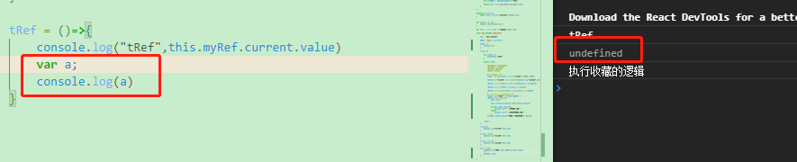
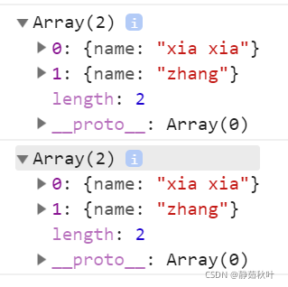
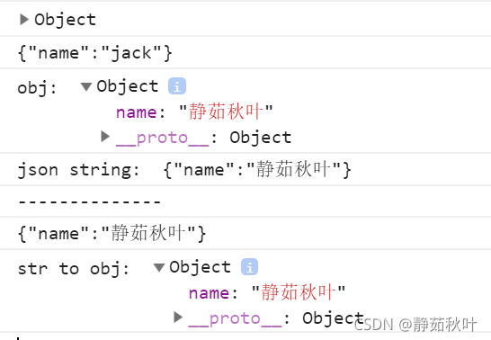

# JavaScript相关知识点 #

## 1.《学习JavaScript数据结构与算法》 ##

1.http-serve - js服务器,http-serve打开指定的端口访问

2.undefined - 声明变量未赋值

3. 
  1=="1" 对的 toNumber("1") = 1 1==1

  1===1 对的

4.delete运算符

5.js中的false

undefined null NaN +0 -0 长度为0的字符串 false

6.对象始终为true

> new Biilean(false) - true
> 
> new String('') - true
> 
> new Number(NaN) - true
> 
> {} - true

7.当使用 == 做比较时候会按照下表进行转换后比较

**例子**： console.log('packt'==true) ? 
输出为**false**

字符串与布尔比较，字符串转为数字再比，数字与字符串比较，字符串转为数组再比，则toNumber(true) = 1 , toNumber('packt') = NaN
1 != NaN , 所以结果为false，其余的也做同类型表

**关于** toPrimitive  
js的内部函数 - **数组就是对象**

> 对象转原始类型会调用内置的[toPrimitive]函数，该函数逻辑如下：
> 如果已经原始类型，就不需要转换
> 调用x.valueOf()，如果转换为基础类型，就返回转换的值
> 调用x.toString()，如果转换为基础类型，就返回转换的值
> 如果没有返回原始类型，就会报错

**什么时候使用？** - 对象类型与字符串或者数字比较的时候

**值得注意的是：** NaN不等于NaN NaN也不等于undefined  
使用isNaN判断

Number(b.toString())==Number(b.toString())  - 也返回false

8.当使用 === 判断时候，类型不相同直接返回false

**值得注意的是：**两个对象比较时候，两个引用同一个对象的时候才true，不同对象但相同结构仍为false(指针相关)，引用类型；--数组也是如此

9.面向对象编程时，对象是类的实例

10.js中函数原型只有一个形参时，传两个实参不会报错

11.什么时候用while什么时候用for？

知道执行次数的时候一般用for，条件循环时一般用while。

12.关于**函数原型** - prototype

使用函数原型定义函数时，函数只会被创建一次，直接定义则每个实例都会创建自己的函数副本。使用原型节约内存

### 原型 ###

proto（隐式原型）与prototype（显式原型，也叫原型对象）

①.是什么

> 显式原型：每一个函数在创建之后都会拥有一个名为prototype的属性，这个属性指向函数的原型对象。
> 
> 隐式原型：JavaScript中任意对象都有一个内置属性[[prototype]]，在ES5之前没有标准的方法访问这个内置属性，但是大多数浏览器都支持通过__proto__来访问。ES5中有了对于这个内置属性标准的Get方法
> Object.getPrototypeOf(). Object.prototype 这个对象是个例外，它的__proto__值为null

②.两者的关系和作用

>     关系：隐式原型指向创建这个对象的函数(constructor)的prototype
>     
>     作用：
>     显式原型的作用：用来实现基于原型的继承与属性的共享。
>     隐式原型的作用：构成原型链，同样用于实现基于原型的继承。举个例子，当我们访问obj这个对象中的x属性时，如果在obj中找不到，那么就会沿着__proto__依次查找。

③.图解

首先，要明确几个点：

(1).**在JS里，万物皆对象**。

方法（Function）是对象，方法的原型(Function.prototype)是对象。因此，它们都会具有对象共有的特点。

即：对象具有属性__proto__，可称为隐式原型，一个对象的隐式原型指向构造该对象的构造函数的原型，这也保证了实例能够访问在构造函数原型中定义的属性和方法。

(2).方法(Function)

方法这个特殊的对象，除了和其他对象一样有上述_proto_属性之外，还有自己特有的属性——原型属性（prototype），这个属性是一个指针，指向一个对象，这个对象的用途就是包含所有实例共享的属性和方法（我们把这个对象叫做原型对象）。

原型对象也有一个属性，叫做constructor，这个属性包含了一个指针，指回原构造函数。constructor属性用来测试对象的类型，除此之外，就不要使用。同时，原型对象的__proto__指向Object.prototype

知道了这两个基本点，我们来看看上面这副图。

1).构造函数Foo()

构造函数的原型属性Foo.prototype指向了原型对象，在原型对象里有共有的方法，所有构造函数声明的实例（这里是f1，f2）都可以共享这个方法。

2).原型对象Foo.prototype

Foo.prototype保存着实例共享的方法，有一个指针constructor指回构造函数。

3).实例

f1和f2是Foo这个对象的两个实例，这两个对象也有属性 __ _proto___，指向构造函数的原型对象，这样子就可以像上面1所说的访问原型对象的所有方法啦。
另外：

构造函数Foo()除了是方法，也是对象啊，它也有 __ _proto___ 属性，指向谁呢？
指向它的构造函数的原型对象呗。函数的构造函数不就是Function嘛，因此这里的 __ _proto___指向了Function.prototype。

其实除了Foo()，Function(), Object()也是一样的道理。

原型对象也是对象啊，它的 __ _proto___属性，又指向谁呢？

同理，指向它的构造函数的原型对象呗。这里是Object.prototype.

最后，Object.prototype的 __ _proto___属性指向null。

**总结：**

对象有属性 __ _proto___ ,指向该对象的构造函数的原型对象。

方法除了有属性 __ _proto___,还有属性prototype，prototype指向该方法的原型对象。

13.关于js调试工具部分

ctrl+shift+I

**14.JS中map()方法！！**

map定义和方法 map()方法返回一个新数组，数组中的元素为原始数组元素调用函数处理的后值。

map()方法按照原始数组元素顺序依次处理元素。

    map() 方法创建一个新数组，其结果是该数组中的每个元素都调用一个提供的函数后返回的结果。
    var array1 = [1,4,9,16];
    const map1 = array1.map(x => x *2);
    console.log(map1);

### 15.深拷贝浅拷贝 ###
**①.概念**

深拷贝与浅拷贝在其它语言中也经常被提及到，因为它们分别对应着**值拷贝**与**引用拷贝**。 

**深拷贝：**从字面上的意思理解，是指很深的拷贝，到底有多深呢？深到不仅拷贝值，而且还独立开辟了一个空间。我的理解是：拷贝的过程中，独立地开辟了一个空间，这个对象指向这个地址，与原来的对象互不干扰。深拷贝也被称为值拷贝。 

**浅拷贝：**从字面上的意思理解，是指比较浅的拷贝，它与原来的变量仍然指向同一个地址，两者之间相互影响，即其中一个改变会影响另一个的改变。**浅拷贝也被称为引用拷贝**，引用的意思就是取了个别名，例如张三是大名，狗蛋是他的引用，即为小名，张三变了，狗蛋自然也变了，因为他们本质上就是指同一个人

**②.js中的深拷贝(值拷贝)**

js中的基本数据类型：String Number Boolean Null Undefined，在赋值的过程中都是值拷贝.
例如，let a = 10 ; b = a , 修改其中一个变量的值，不会影响到另一个变量的值

**③.js中的浅拷贝(引用拷贝)**

js中的对象数据类型：Object Array Function Map Set，在赋值过程中都是引用拷贝(指向同一个地址，相当于一个房间多了一个钥匙)

**④.将浅拷贝装换为深拷贝**

## Array深拷贝几种方法 -- slice()方法 ， concat方法 ， ES6语法中使用[...arr] , Array.from方法

## Object的深拷贝 -- Object.assign() ， 万能转换器JSON.parse(JSON.stringify(obj)) ， 
  
1）Array的深拷贝

###slice方法

> slice()操作数组时，不会对原数组有影响，会产出一个新的数组。

	 let arr1 = [1, 42, 5, 6]
	 let arr2 = arr1.slice()
	 arr2[0] = 100
	 console.log(arr1) // [1, 42, 5, 6]
	 console.log(arr2) // [100, 42, 5, 6]

数组arr2的改变未引起arr1的变化

###concat()方法

> 数组的concat()方法，能够连接两个数组，同样不会改变原来的数组。用一个空数组连接另一个数组，即可实现深拷贝。

	let arr3 = ['cat', 'dog', 'pig']
	let arr4 = [].concat(arr3)
	arr3[2] = 'big pig'
	console.log(arr3) // ['cat', 'dog', 'big pig']
	console.log(arr4) // ['cat', 'dog', 'pig']

###ES6语法中 ...

> ES6语法中的 …， 我经常在数组的深拷贝中用到。

	let arr5 = [0, 0, 1]
	let arr6 = [...arr5]
	arr5[0] = 10000
	console.log(arr5) // [10000, 0, 1]
	console.log(arr6) // [0, 0, 1]
  
2）Object的深拷贝

###Object.assign()方法

> ES6的Object.assign() Object.assign(target, …sources)用于对象的合并，将源对象中的所有可枚举属性，复制到目标对象中，并返回合并后的目标对象。后来的源对象的属性值，将会覆盖它之前的对象的属性。

	 let person = {
	     name: 'xia',
	     age: 25,
	     height: 160
	 }
	 let otherPerson = Object.assign({}, person)
	 person.age = 30
	
	 console.log(person)
	 console.log(otherPerson)

### 万能转换器（对Array和Object等都适用）

> 前面讲解了 Array和Object的深拷贝方法，但是对于有更深层次的结构关系（数组套数组 数组套对象 对象套对象等），上面的方法就失灵了，可以看下面的例子。

	let personArr = [{name: 'xia'}, {name: 'zhang'}]
	let otherPersonArr2 = [...personArr]
	personArr[0].name = 'xia xia'
	console.log(personArr)
	console.log(otherPersonArr2)

**万能转换器 JSON.parse(JSON.stringify(obj))深拷贝已有对象，它可以深拷贝多层级的，不用担心嵌套问题。**

- JSON.stringfy() 将对象序列化成json对象
- JSON.parse() 反序列化——将json对象反序列化成js对象

JSON.stingify(obj)将js中的对象转换成JSON字符串

	 let jack = {
	     name: 'jack'
	 }
	 console.log(jack)
	 console.log(JSON.stringify(jack))

它们在格式上有区别。下图中的第一个是对象，name没有双引号括起来。第二个是json字符串，其中，name用双引号括起来了

**JSON.parse()将json字符串解析成对象**

	 let obj = {
	     name: '静茹秋叶'
	 }
	 console.log('obj: ', obj)
	 console.log('json string: ', JSON.stringify(obj))
	
	 let str = JSON.stringify(obj)
	 console.log('--------------')
	 console.log(str)
	 console.log('str to obj: ', JSON.parse(str))

 
### 16.JS关于promise ###

> ECMAscript 6 原生提供了promise对象
> 
> Promise对象代表了未来将要发生的事件，用来传递异步操作的消息

①概述 
Promise是异步编程的一种解决方案，可以代替传统的解决方案--回调函数和事件。ES6统一了用法，并原生提供了Promise对象。作为对象，Promise有一下两个特点：

*1)对象的状态不受外界影响。 
*2)一旦状态改变了就不会在变，也就是说任何时候Promise都只有一种状态

②Promise的状态

### 17.JS箭头函数 ###

> 箭头函数都是匿名函数
> 
> 普通函数**可以**是匿名函数

	// 具名函数
	function func(){
	  // code
	}
	 
	// 匿名函数
	let func=function(){
	  // code
	}
	
	// 箭头函数全都是匿名函数
	let func=()=>{
	  // code
	}

> 箭头函数不能用于构造函数，不能使用new
> 
> 普通函数可以用于构造函数吗，从此创建对象实例

	function Person(name,age){
	   this.name=name;
	   this.age=age;
	}
	let admin=new Person("恩诺小弦",18);
	console.log(admin.name);
	console.log(admin.age);

> 箭头函数中的this的指向不同

普通函数中this总是指向<a style="color:red;">调用它的对象，</a>如果用作构造函数，this指向<a style="color:red;">创建的对象实例</a>。

箭头函数没有自己的this，它的this是继承而来，默认指向在定义它时所处的对象(宿主对象)。

 

> 其他区别 

- 箭头函数不能Generator函数，不能使用yeild关键字。 

	我们可以理解yield是一个暂停动作，这个暂停动作可以接受上一步的结果作为参数，也可以额将这一阶段执行的结果返回给外部。上面整个做菜过程，是可以临时掺杂其他的事情的，这就是yield的最大作用。
	了解了yield之后，更能理解generator的存在意义。实际上它和promise一样，是用来解决函数异步调用的。

- 箭头函数不具有prototype原型对象。
- 箭头函数不具有super。 

	*super 方法
	
	super作为函数调用时，代表父类的构造函数。
	ES6 要求，子类的构造函数必须执行一次super函数。子类B的构造函数之中的super()，代表调用父类的构造函数。
	注意，super虽然代表了父类A的构造函数，但是返回的是子类B的实例，即super内部的this指的是B的实例，因此super()在这里相当于A.prototype.constructor.call(this)。
	作为函数时，super()只能用在子类的构造函数之中，用在其他地方就会报错。
	
	*super 对象
	
	super作为对象时，在普通方法中，指向父类的原型对象，在静态方法中，指向父类。
	由于super指向父类的原型对象，所以定义在父类实例上的方法或属性，是无法通过super调用的。ES6 规定，在子类普通方法中通过super调用父类的方法时，方法内部的this指向当前的子类实例。由于this指向子类实例，所以如果通过super对某个属性赋值，这时super就是this，赋值的属性会变成子类实例的属性。
	如果super作为对象，用在静态方法之中，这时super将指向父类，而不是父类的原型对象。在子类的静态方法中通过super调用父类的方法时，方法内部的this指向当前的子类，而不是子类的实例。

- 箭头函数不具有new.target。 

	new.target允许你检测函数或构造方法是否是通过new运算符调用的，若函数或构造方法是由new调用的，则new.target属性的值指向该函数或构造函数，否则值为undefined。

> 总结：

- 箭头函数的 this 永远指向其上下文的 this ，任何方法都改变不了其指向，如 call() , bind() , apply() 

- 普通函数的this指向调用它的那个对象

### 18.匿名函数的应用 ###

1.绑定事件

	<input type="button" value="点击" id="btn">
	
	//javascript
	var btn=document.querySelector("#btn");    //querySelector是H5中新增的查找dom元素的方法
	    		btn.οnclick=function(){
	    			alert("");
	    		}

2.应用对象

	var obj={
	
	    animal:"汤姆猫",
	
	    voice:"喵喵喵~~",
	
	    CAT:function(){
	
	        return "我是"+this.animal+"，我会"+this.voice+"叫！";
	
	    }
	
	};
	
	alert(obj.CAT());

3.应用函数表达式

	//将匿名函数赋值给变量cat
	var cat=function(){
	
	    return "喵喵喵~~"
	}
	//调用方式与调用普通函数一样
	alert(cat());

4.回调函数的应用

	setInterval(function(){
	
	    console.log("我是每5秒执行一次的回调函数");
	},5000);

5.返回值

	function cat(){
	    //返回匿名函数
	    return function(){
	
	        return "喵喵喵~~";
	    }
	}
	//调用匿名函数
	alert(cat()());
	//或
	var mao=cat();
	alert(mao());

6.链式调用

	(function(animal) { 
	
	alert(animal); 
	
	return arguments.callee; 
	
	})('cat')('dog')('pig');

链式调用： 例

$('text’).setStyle('color', 'red').show();

一般的函数调用和链式调用的区别：<a style="color:red;">链式调用完方法后，return this返回当前调用方法的对象<a>。

<a style="color:black">(1)先创建一个简单的类</a>

	//创建一个bird类
	function Bird(name) {
        this.name=name;
        this.run=function () {
        document.write(name+" "+"start run;");
                }
        this.stopRun=function () {
         document.write(name+" "+"start run;");
                }
        this.sing=function () {
            document.write(name+" "+"start sing;");
        }
        this.stopSing=function () {
            document.write(name+" "+"start stopSing;");
        }
    }
(2)使用方式：一般的调用方式

 	var bird=new Bird("测试");
    bird.run();
    birdbird.sing();
    bird.stopSing();
    bird.stopRun();
（3）总结，该种方式有一个弊端就是：多次重复使用一个对象变量
然后，我们再来看看将上述改成链式调用的格式

(1)在创建的简单类中加上return this，如下

	//创建一个bird类
   
	 function Bird(name) {
        this.name=name;
        this.run=function () {
            document.write(name+" "+"start run;");
            return this;// return this返回当前调用方法的对象。
        }
        this.stopRun=function () {
            document.write(name+" "+"start run;");
            return this;
        }
        this.sing=function () {
            document.write(name+" "+"start sing;");
            return this;
        }
        this.stopSing=function () {
            document.write(name+" "+"start stopSing;");
            return this;
        }
    }

(2)使用链式调用（连缀的方式）

	var bird=new Bird("测试");
    bird.run().sing().stopSing().stopRun();//结果为;测试 start run;测试 start sing;测试 start stopSing;测试 start run;

(3)总结此种方式的调用结果与一般的调用方式产生的结果一样，优点是：链式调用这种风格有助于简化代码的编写工作，让代码更加简洁、易读，同时也避免多次重复使用一个对象变量

### 19.filter使用(includes) ###

> 例:找到数组中包含a的

    /**
     * filter 不会改变原对象
     */
    
    var arr = ["aaa","abc","bcc"]

	//前面为数组内元素，后面为回调方法，当返回true时候不会过滤掉此数组项
    
    var newarr = arr.filter(item=>item.includes("a"))
    
    console.log(newarr) 输出为 ["aaa","abc"]

### 20.关于localStorage ###

**HTML API**

localstorage 在浏览器的 API 有两个：localStorage 和sessionStorage，存在于 window 对象中：localStorage 对应 window.localStorage，sessionStorage 对应 window.sessionStorage。

localStorage 和 sessionStorage 的区别主要是在于其生存期。

**基本使用方法**

- 这里的作用域指的是：如何隔离开不同页面之间的localStorage（不能在百度的页面上能读到腾讯的localStorage）。

- localStorage只要在相同的协议、相同的主机名、相同的端口下，就能读取/修改到同一份localStorage数据。

- sessionStorage比localStorage更严苛一点，除了协议、主机名、端口外，还要求在同一窗口（也就是浏览器的标签页）下。

**生存期**

- localStorage理论上来说是永久有效的，即不主动清空的话就不会消失，即使保存的数据超出了浏览器所规定的大小，也不会把旧数据清空而只会报错。但需要注意的是，在移动设备上的浏览器或各Native App用到的WebView里，localStorage都是不可靠的，可能会因为各种原因（比如说退出App、网络切换、内存不足等原因）被清空。
- sessionStorage的生存期顾名思义，类似于session，只要关闭浏览器（也包括浏览器的标签页），就会被清空。由于sessionStorage的生存期太短，因此应用场景很有限，但从另一方面来看，不容易出现异常情况，比较可靠。

**容量限制**

目前业界基本上统一为5M，已经比cookies的4K要大很多了。

**域名限制**

由于浏览器的安全策略，localstorage是无法跨域的，也无法让子域名继承父域名的localstorage数据，这点跟cookies的差别还是蛮大的。

**异常处理**

localstorage在目前的浏览器环境来说，还不是完全稳定的，可能会出现各种各样的bug，一定要考虑好异常处理。我个人认为localstorage只是资源本地化的一种优化手段，不能因为使用localstorage就降低了程序的可用性，那种只是在console里输出点错误信息的异常处理我是绝对反对的。localstorage的异常处理一般用try/catch来捕获/处理异常。

**如何测试用户当前浏览器是否支持localstorage**

目前普遍的做法是检测window.localStorage是否存在，但某些浏览器存在bug，虽然"支持"localstorage，但在实际过程中甚至可能出现无法setItem()这样的低级bug。因此我建议，可以通过在try/catch结构里set/get一个测试数据有无出现异常来判断该浏览器是否支持localstorage

**浏览器兼容性**

**在ios设备上无法重复setItem()**

> 另外，在iPhone/iPad上有时设置setItem()时会出现诡异的QUOTA_EXCEEDED_ERR错误，这时一般在setItem之前，先removeItem()就ok了。

### 21.async、await ###

一、async用法

async作为一个关键字放在函数前面，用于表示函数是一个异步函数。异步函数也就意味着**函数的执行不会阻塞后面代码的执行。**

调用：异步函数也是函数，怎么调用函数就怎么调用它，直接加括号就可以了

async函数返回一个promise对象，如果获取到promise返回值，我们应该用then方法

你可能注意到控制台中的Promise 有一个resolved，这是async 函数内部的实现原理。如果async 函数中有返回一个值，当调用该函数时，内部会调用Promise.solve() 方法把它转化成一个promise 对象作为返回，但如果timeout 函数内部抛出错误呢？ 那么就会调用Promise.reject() 返回一个promise 对象， 这时修改一下timeout 函数

### 22.babel含义及作用 ###

Babel含义：

> Babel 是一个 JavaScript 编译器，它能让开发者在开发过程中，直接使用各类方言（如 TS、Flow、JSX）或新的语法特性，而不需要考虑运行环境，因为 Babel 可以做到按需转换为低版本支持的代码；Babel 内部原理是将 JS 代码转换为 AST，对 AST 应用各种插件进行处理，最终输出编译后的 JS 代码。

在开发中我们在写es6+语法的时候是不是很方便，什么promise、async await`，可是es6+语法写的虽然很酸爽，但是浏览器他不兼容啊，你想想你写的代码在浏览器上跑不起来，在好的语法在好的特性又有什么用？

这个时候Babel这样一个工具出来了，他可以将我们写的es6+语法转换为浏览器兼容的语法，比如将箭头函数转换为普通函数，有了这样一个工具我们就即可以写酸爽的语法，又可以让使浏览器兼容。

#### 三大步骤 ####

- 最常见的 @babel/preset-env 预设，包含了一组最新浏览器已支持的 ES 语法特性，并且可以通过配置目标运行环境范围，自动按需引入插件。

- 解析阶段：Babel 默认使用 @babel/parser 将代码转换为 AST。解析一般分为两个阶段：词法分析和语法分析。

- 转换阶段：Babel 使用 @babel/traverse 提供的方法对 AST 进行深度优先遍历，调用插件对关注节点的处理函数，按需对 AST 节点进行增删改操作。

- 生成阶段：Babel 默认使用 @babel/generator 将上一阶段处理后的 AST 转换为代码字符串。

- **Babel 插件系统**
- Babel 的核心模块 @babel/core，@babel/parser，@babel/traverse 和 @babel/generator 提供了完整的编译流程。而具体的转换逻辑需要插件来完成。

- 在使用 Babel 时，我们可通过配置文件指定 plugin 和 preset。而 preset 可以是 plugin 和 preset 以及其他配置的集合。Babel 会递归读取 preset，最终获取一个大的 plugins 数组，用于后续使用。

- 常见 presets

- @babel/preset-env
- @babel/preset-typescript
- @babel/preset-react

### 23.闭包 ###

	console.log("----------简单的闭包----------")

        function closeFunction() {
            console.log("闭包内部")

            let i = 1;

            function inner() {
                i++
                console.log(i)
            }
            return inner
        }

        var f1 = closeFunction();
        f1()  //输出2
        f1()  //输出3
        var f2 = closeFunction()
        f2()  //输出2
        f2()  //输出3

        //总结：inner函数中的i就是行程闭包的”元凶“，由于inner函数没有自己的i变量，所以会引用
        //     外部作用域(closeFunction作用域)的i变量，因此当inner函数被返回后，closeFunction
        //     的i变量得不到释放，因为f对其有引用，因此i变量一直会在内存中，知道f=null

        //可以利用闭包保存函数的变量，并且外部无法直接访问到内部变量，避免定义过多全局变量

    console.log("----------非闭包效果----------")

        function simpleFunction() {
            console.log("简单函数")
            let i = 1;
            i++;
            console.log(i)
        }
        simpleFunction()  //输出2
        simpleFunction()  //输出2

    console.log("----------非闭包应用场景----------")

## 24.ES6 ##

> 总结es6相关的知识点

### 字符串拼接 ###
使用反引号 ``

例子：

	let str='我是佩奇'
	console.log(`你是野猪${str}`)
	//结果 你是野猪我是佩奇

### ES6中数组新语法 ###

#### map() ####
数组.map()也就是映射。通俗地讲就是遍历数组，且修改每一个数组元素，返回的结果是一个新的数组。举个简单的例子，假设商场打折，给每件商品打8折，其中arr数组中是所有商品的价格：

	let arr = [89, 50, 99, 45, 100, 30, 60, 30]
	console.log(arr.map(item => item * 0.8))//0:71.2 1: 40 2: 79.2 3: 36 4: 80 5: 24 6: 48 7: 24 length: 8
如果难理解的话，可以看下所示的：

	let arr = [89, 50, 99, 45, 100, 30, 60, 30]
	let newArr = arr.map((item) => {
	    return item * 0.8
	})
	console.log(newArr)//0:71.2 1: 40 2: 79.2 3: 36 4: 80 5: 24 6: 48 7: 24 length: 8
#### 2.filter() ####
数组.filter()是筛选数组的，将符合条件的元素放入新数组中，如果存在，返回所有满足条件的新数组，不存在，则返回空数组，且这个方法的执行次数等于数组的长度。举个简单的例子，找到数组中所有的负数：

	let arr1 = [12, 23, -2, 45, 2, 13, -9]
	console.log(arr1.filter(item => item < 0)) //0:-2  1:-9  length:2
	let arr2 = [1, 2, 3, 4]
	console.log(arr2.filter(item => item < 0))//[]
#### 3.forEach() ####
数组.forEach()等价于for(let i=0;i<arr.length;i++){........}本质就是对数组的遍历

	let arr = [10, 23, 41, 23, 56]
	arr.forEach((item, index) => {
	    console.log(index, item)//0 10    1 23     2 41    3 23      4 56
	})
### 4.some() ###
数组.some()是用来检测数组中是否有符合条件的元素，返回的结果是布尔型，如果是true表示有符合条件的元素，如果是false则表示没有符合条件的元素，应用场景：非空判断。举个简单的例子，判断一个数组是否存在负数

	let arr1 = [12, 1, 34, -2, 4]
	console.log(arr1.some(item => item < 0)) //true
	let arr2 = [1, 2, 3, 4]
	console.log(arr2.some(item => item < 0)) //false
### 5.every（） ###
数组.every()是用来检测是否所有的元素都满足条件，如果所有元素都满足条件，返回结果为true，反之返回false，这个思想就类似于开关思想，和some()是相反的。举例：判断数组是不是都是正数

	let arr = [1, 3, 2, 5, -2, 6]
	console.log(arr.every(item => item > 0)) //false
### 6.findIndex() ###
数组.findIndex()是用来查找元素的，如果元素存在返回该元素的下标，如果不存在则返回-1，和indexOf作用一样，区别在于indexOf只能查找值类型的数据，而findIndex可以查找引用类型数据。举例：在数组中找李四和小明

	let arr = [{
                name: '张三',
                age: 20
            },
            {
                name: '李四',
                age: 50
            },
            {
                name: '王五',
                age: 20
            }
        ]
        /* 查找李四 */
        console.log(arr.findIndex(item => item.name == '李四')) //1
        console.log(arr.findIndex(item => item.name == '小明')) //-1

### 7.reduce（） ###
数组.reduce()是数组累加器，对数组每一个元素执行一次回调函数，累加最后一次回调的结果，应用场景：求总价。以下面这个例子为例进行详细的讲解：

	let arr = [12, 34, 23, 15, 6]
	console.log(arr.reduce((sum, item) => {
	return sum + item
	}, 0)) //90
因为reduce()，默认下标从1开始，所以需要设置，在reduce里补0，（如果从1开始遍历，遇到空数组会报错）类似于从0下标开始遍历，同样也代表着let sum=0，每次将返回的值赋值给sum，等价于sum=sum+item，每次执行一次，返回的结果将作为下一轮sum的值，且最终返回最后一次执行的结果

# 关于 promise 与 异步编成问题！！ #

https://blog.csdn.net/qq_47443027/article/details/118763485