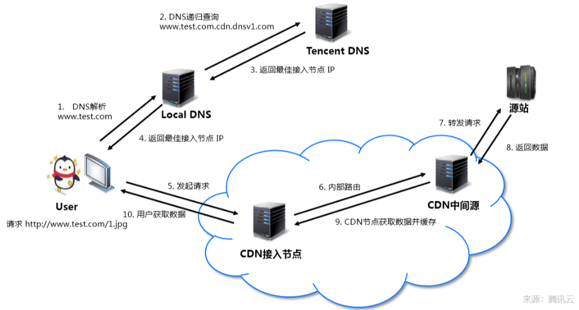
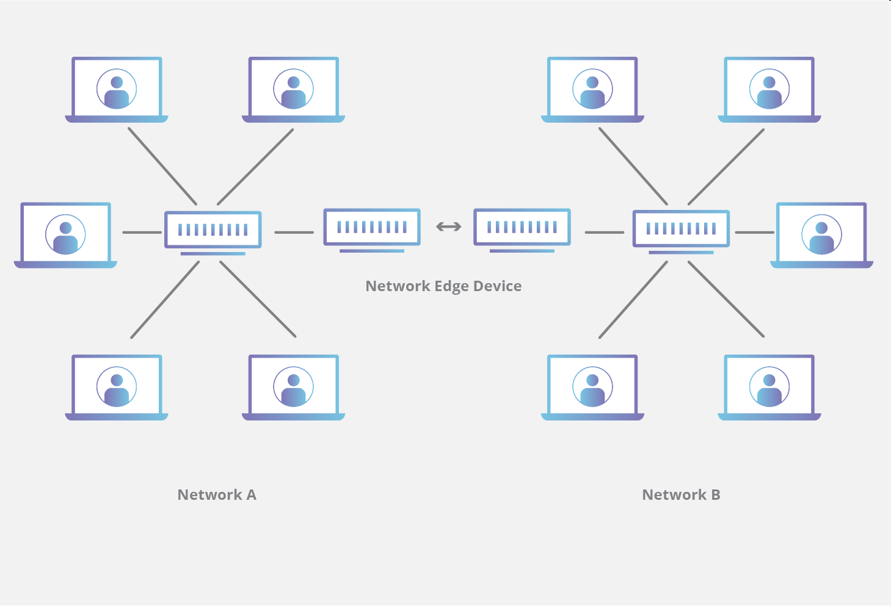
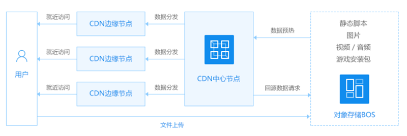

# CDN #

**<h3>什么是<a style = "color:red">CDN</a>？</h3>**

CDN的全程是Content Delivery NetWork，即内容分发网络。CDN是构建在现有网络基础之上的智能虚拟网络，依靠部署在各地的边缘服务器，通过中心平台的负载均衡，内容分发，调度等功能模块，使用户就近获取所需内容，降低网络拥塞，提高用户访问响应速度和命中率。

## CDN原理 ##
以腾讯云为例，假设业务源站域名为 www.test.com ， 域名接入CDN开始使用加速服务后，当用户发起HTTP请求时，实际的处理流程如下图:

## CDN作用 ##

- CDN缓存内容后，用户仅需访问就近的CDN节点即可获取静态内容。
- 环节源站带宽压力，网络费用更低。
- 分布全球的跨境节点提升跨境访问体验。

## 网站域名接入CDN ##

- 开通CDN服务器后，配置域名信息(域名必须备案)
- 静态文件加速选CDN网页小文件
- 进行源站配置 (“回源协议”设置的是HTTPS需要进行配置证书)
- 配置完成之后进行CNAME配置(域名解析加上对应的记录值)

**<h3><a style="color:blue;">CDN防御配置</a></h3>**
CDN作为按量付费的产品，防止用户 **盗刷** 产生大量带宽或者流量 
防御盗刷流量或者遭遇**CC、DDOS等攻击**，需要进行配置防御 
### 1.用量封顶配置 ###
如果超出了配置的**访问阈值**，就可以自动关闭 CDN 服务，或者请求直接返回源站，有两种配置方式：

- 带宽封顶
- 流量封顶

### 2.防盗链配置与黑白名单配置 ###
可以进行黑白名单配置来防止盗刷

### 3.IP访问频率配置 ###
通过对单 IP 单节点在每一秒钟的访问次数进行限制，可进行高频 CC 攻击抵御、防恶意用户盗刷等。

### 4.安全加速SCDN ###
腾讯云安全加速SCDN为预付费产品，集成了Web 攻击防护、DDoS防护、CC防护等多项安全功能，可以更加全面地提升加速网络的安全防护能力。

### 5.服务器的面板进行流量控制 ###

## 什么是CDN边缘服务器 ##
**<a style="color:red;">CDN</a>** 边缘服务器是存在于网络逻辑极端或“边缘”的计算机。边缘服务器常用作**不同网络之间的链接**。CDN边缘服务器的主要目的是将内容存储在尽可能 **靠近发出请求的客户端机器的位置** ，从而 **减少延迟并缩短页面加载时间**。 

边缘服务器是一种边缘设备，可提供进入网络的入口点。其他边缘设备包括路由器和路由交换机。边缘设备通常防止在Internet交换点(IxP)内，以允许不同的网络连接和共享传输。

**边缘服务器怎么工作的？** 
在任何特定的网络布局中，许多不同的设备将使用一种或多种预定义的网络模式相互连接。 如果网络想要连接到另一个网络或更大的 Internet，它必须具有某种形式的桥接器，以便流量从一个位置流向另一个位置。 在网络边缘创建此桥的硬件设备称为**边缘设备**。

**网络通过边缘设备链接** 
在连接了许多设备的典型家庭网络中，移动电话或计算机等设备通过中心辐射型网络模型连接或者断开网络。在所有设备都存在于同一个局域网中(LAN)，每个设备都连接到一个中央路由器，通过它们可以相互连接。

为了将第二个网络连接到第一个网络，在某些时候必须在网络之间建立链接。根据定义，**网络**能够**通过其**相互连接的设备是**边缘设备**。

CDN提供商会将服务器放置在许多位置，但其中一些最重要的是不同网络之间边缘的连接点。这些边缘服务器将多个不同的网络连接，并允许流量在网络之间快速有效地传递。如果没有CDN，传输可能会在源和目的地之间采用更慢和/或更复杂的路线。在最坏的情况下，流量将“长号”远距离；当服务器连接到街对面的另一台设备时，连接可能会在全国范围内移动并再此返回。通过在关键位置边缘服务器，CDN能够快速向不同网络内的用户交付内容。

**边缘服务器与源服务器的区别** 
&nbsp;&nbsp;&nbsp;&nbsp;源服务器是在web资产中使用CDN时接收所有Internet流量的web服务器。使用没有CDN的源服务器意味着每个Internet请求都必须返回到该源服务器的物理位置，而不敢它位于世界的那个位置。这回增加加载时间，这回增加服务器与发出请求的客户端机器的距离。 
&nbsp;&nbsp;&nbsp;&nbsp;CDN边缘服务器在战略位置存储(缓存)内容，以便减轻一个或者多个源服务器的负载。通过将图像、HTML和JavaScript文件(以及可能的其他内容)等静态资产尽可能靠近发出请求的客户端机器，边缘服务器缓存能够减少加载WEB资源所需时间。源服务器在使用CDN时仍然发挥着重要的作用，因为重要的服务器端代码(例如用于身份验证的散列客户端凭据数据库)通常在源端维护。

## CDN与对象存储的关系 ##

对象存储的核心是存储，以及计算能力(图片处理)，cdn的核心是分发，本身不会给用户提供直接操作储存的入口，所以两者配合使用。

百度云对象存储于CDN配合使用图

**对象存储：鱼与熊掌兼得的存储方式** 
对象存储将数据通道(需要访问的数据)和控制通路(云数据，即索引)分离，先根据索引(也就是元数据)找到数据存储的位置，进行通过底层的存储接口来访问数据。

通过这种方式，对象存储既有类似块存取性能，也有类似文件存储的共享便利，可谓是鱼和熊掌兼得的存储方式，对象存储主要用来存储**图片、音频、视频等非结构化数据**。

**CDN：让用户离数据更近一点** 
CDN(Content Delivery Network)是内容分发网络。基本思路就是在网络各处部署服务器节点，系统实时地根据网络流量、负载状况、服务器节点到用户的响应时间等信息，自动将用户请求到导向离用户最近的节点上。**目的就是让用户就近取得数据，提高响应速度。**

**CDN的关键技术**

1. 内容发布：借助于索引、缓存、流分裂、组播等技术，将内容发布或投递到距离用户最近的服务器节点；
1. 内容路由：整体性的网络负载均衡技术，通过内容路由器中的重定向机制，在多个服务器节点上均衡用户的请求；
1. 内容交换：根据内容、服务器节点以及用户的信息，利用应用层交换、流分裂等技术，智能地平衡负载流量；
1. 性能管理：通过内部和外部监控系统，获取网络部件的状况信息，测量内容发布的端到端性能。

CDN本质上是一个分布式缓存系统，每个服务器节点上都缓存了源站的一部分数据，也就是用户最近经常访问的数据访问的数据。这样大部分用户请求其实都是在**CDN边缘节点上完成，并没有达到源站，这样减少了响应时间，也减轻了源站的负担，可以实现高流量、大并发的网站访问。**