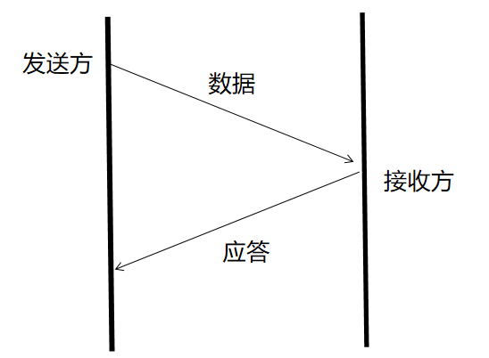

# 通信协议 #
## 一、网络分层架构 ##

## 二、TCP和UDP协议 ##
### 1.UDP协议 ###
UDP（user Datagram Protocol）:用户报文协议 
没有任何特点 
和TCP对比：不可靠、无连接、面向报文 
**1.UDP作为一种简单的传输层协议，基本上没有什么操作来帮助用户处理复杂的网络环境，所以UDP保留下来这种不可靠的特性。**

**2.UDP报文的头信息(定长的(8字节))**

**3.校验和（checksum）的作用和工作机制** 

- 判断收到的报文(数据)是否出现差错的
- 利用**hash函数**的原理：通过设计一种hash函数，达到冲突率很低的一种情况
  **发送端**:checksum(payload)=>校验和1（把校验和1填写到UDP的header中）
  **接收端**:checksum(payload)=>校验和2
  **比较**校验和2和header中的校验和1：如果**不等**，payload在传输过程中一定**出现差错了**；如果**相等**，**大概率payload没有出现出错**
- 针对校验和可以对上的情况，**正常接收数据**。
  针对校验和**对不上的情况，直接丢包**；UDP**不是特别可靠**

**4.UDP协议栈的作用** 

1. **计算校验和**
1. **填写正确的header信息**
1. **把header + payload一起交给网络层**(*重点：UDP没有**发送**缓冲区)
1. **网络层发送数据到网卡**
1. **send方法返回**
 *重点：我们在应用层调用send方法时方法返回了，就**意味着数据已经到达了网络层中**

接收到数据后

1. **计算校验和**
1. **解包**
1. **通知指定的进程，数据已经到达...这段期间**，进程可能还暂时来不及过来取数据。所以UDP协议栈需要找个地方把数据暂存一会儿。UDP协议栈中有**接收缓冲区**。

**5.UDP有接收缓冲区，没有发送缓冲区** 

用戶发送多少数据，UDP也会发送多少数据，所以**UDP是面向报文的** 
UDP发送数据无需任何准备工作，随时随地可以发送：寄件VS打电话，所以UDP是**无链接的**

**6.面向报文导致的一个后果** 

由于底层(物理层+网络层)都对**一次发送**的数据大小限制。如果强行发送大于限制的数据，就会出现数据被截断 
**全双工**：同一个通道是双向的

**7.UDP协议的最适合场景** 
对实时性要求较高、对可靠性要求较低的场景
实时聊天(语音、视频聊天)
UDP支持广播。如果有广播需求可以考虑UDP。

### 2.TCP协议 ###
TCP(Transmission Control Protocol):传输控制协议

**1.目标** 

- 以进程为单位传递数据
- 追求可靠性

**2.什么是可靠性** 
TCP只能保证自己最大的可能，把数据有序地发送给对方。但**不能保证一定发送给对方** 

1. 尽可能去**发送**给对方
1. 就算发不过去，也有**反馈**
1. 保证对方接收是**有序的**
1. 保证对方**不会收到差错数据**
1. **TC**会设计一些机制，来尽可能的**优化网络**，提高对方收到的可能性

**TCP使用什么样的机制，来保证可靠性 -- 确认应答机制**

    TCP发送的数据，一般被称为segment(数据段)

    应答：acknowledge

1. 如果发送方同时发送了多条segment，应答进行了多次应答。发送方如何得知，接收方收到的是那一次的segment? 
 **编号机制**：发送方为发送的数据做编号，应答的时候带上对应编号即可。
1. 如果接收方没有收到数据，则不会应答；或者接收方应答了。但应答丢包了 
 总之：发送方没有收到对应的应答。则认为对方没有收到数据 -- **超时重传机制**

**3.TCP协议的header格式** 

1. 和UDP不同，TCP的header**不是定长**的。
1. 哪个或者哪些字段，可以保证接收方的**TCP协议栈进行解包**工作？ 
**4位的header长度**
1. 根据源port+目标port做分用
1. 到目前为止，TCP发送的segment有两种：（1.**携带数据**segment 2.**应答** segment），TCP协议并没有把两种作用的segment进行不同格式的设计，而是进行**统一的设置**了！ 
那具体怎么区分本次segment**是否具有应答**的作用呢？ 
**ack == 1时segment有应答功能；ack==0时segment没有应答功能**
1. segment的可能情况(1)光携带数据；(2)携带数据+应答(网络中合并数据发送，可以提高网络发送的效率)
1. 32位序号：SN(sequence Number) 
32位确认序号：ASN(AckNowledge Sequence Number)

**4.SN和ASN书写规则** 

1. TCP为发送每个字节都进行**编号**(只是payload，没有header) [h e l l o] 
**h:108(随便选的)，e:109 ，l:110 ，l:111 ，0:112** 
1. **TCP协议栈**在建立链接时，会**随机一个初识序列号**(Initial Sequence Number ISN)**ISN:108**
1. 发送的时候，header中的**SN**填写的是payload中的**第一个字节的序列号** 
**[hello] 
SN:108 **
接收方是知道长度是5的，所以，接收方如果**收到数据**，则表示**108-112**已经全部收到了
1. ASN应该如何填写？**填写的是接收方期望收到的下一个字节的数据** 
上述例子中，**接收方要应答的话ASN应该填写113**。隐含的意思就是113之前的所有数据，已经全部接收到了。

5. 如果发送方**超过一定时间都没有收到应答**，则可能

发送方的处理逻辑是一致的。超时之后，直接重传即可(重传的数据不会丢失)，不需要区分情况

6 . 如果**乱序**到达怎么办？

对于发送方，收到了一个应答segASN=x时，发送方是怎么理解这个信号的？ 
对方已经收到收到了x-1之前的所有数据了。 
**TCP协议是有接收缓冲区的，保证对方接收是有序的**(接收端可以重新整理数据，接收过得数据不再接收)

**如果超时之后，重传对方仍然没有收到，怎么办？** 
继续重传，直到到达一个阈值（假设6次）。如果6次，我都没有收到应答。我就认为不需要再努力的，放弃：

1. 尽人事，试图通知对方，链接异常关闭了---通过发送一个reset segment(另一种)。 
rst = 1，reset segment 
rst = 0，不是reset segment 
1. 通过我们的应用层，数据发送失败了。(Java中是通过异常的方式通知的，会收到一个IOException(SocketException)描述reset connection)

**5.链接管理（Connection Message）** 

为什么需要链接（链接是什么抽象）?

1. 作为TCP协议栈，是需要维护一个**接受缓冲区**的。 
	①.保证整理乱序到达的数据 
    ②.在数据暂时未被应用层读走之前，临时保存数据

1. 作为TCP协议栈，是需要维护一个**发送缓冲区**的。 
	因为要考虑重发的可能性，所以未应答的数据不能直接扔掉，所以需要一个空间暂存 
	例：send("hello")成功，代表数据被发送到OS的TCP协议栈的发送缓冲区中

1. 作为TCP协议栈 
	发送方时，需要维护**已经发送的SN** 
	接收方时，需要维护**应该应答的SN**

上述3点，足以说明：TCP协议栈，为了保证之前的那些机制可用，**必须为每个信道，维护一组相关的数据**！！

**6.建立连接的必要性** 

1. 由于TCP是追求可靠的，所以TCP在正式发送之前，想验证下对象是否能收到我的数据。 
类比:寄信 + 电话

1. Connection对象，有一部分信息是无法独立知道的，需要双方进行有效信息的同步

**TCP的建立链接，需要双方交换几次信息---三次---三次握手** 
[为什么是三次？]

TCP是需要保证可靠性的，所以，任意数据(除了应带，reset)都需要进行应答

(2)、(3) 事实上，总是可以同时发送的，为了提升网络利用率，所以合并(2)、(3)

四种segment:数据segment、应答segment(ack=1)、reset segment(rst=1)、同步segment(syn=1)

	1. 什么是链接，为什么TCP需要有链接，UDP就没有链接。
	   逻辑上对信道的抽象。物理上各自内存中维护的信道相关的一组数据。
	   因为TCP为了追求可靠性引入一系列机制（确认应答机制，超时重传机制），为了这些机制能正常的工作，是的TCP必须引入链接的概念。
	2. 建立链接阶段的必要性
	   互相确认对象在线
	   双方同步必要的初识信息
	3. 	为什么要三次握手

## 三、域名解析及为什么选用UDP协议 ##
## 1.DNS是什么？ ##
DNS ( Domain Name Systme)简单理解就是**解析器、域名服务器的组合**，比如大家访问知乎，会输入http://www.zhihu.com，事实上网站域名只是一个IP 地址，人们是很难记住各式各样的IP地址的，所以就需要DNS服务器了， DNS 就像手机通讯录一样，存放着各亲朋好友的手机号。为什么要存储到通讯录里？因为你不可能记得一百个人的手机号码，但是通过名字你可以快速定位某位朋友的手机号码。DNS就是存储了各种IP地址，然后让你通过域名定位到IP地址来进行连接通信的。 

- DNS主要作用就是将主机域名转换为ip地址
- 所有DNS请求和回答报文使用的UDP数据报经过端口53发送
- DNS是应用层协议，client端（一般指游览器）构建DNS查询请求，一次被传入传输层，网络层，数据链路层等封装传送到达DNS服务器端，最终client端接收到DNS响应消息

**为什么选择UDP** 

UDP（User Datagram Protocol）这样的无连接的，尽最大能力交付的不可靠数据连接，而不是使用TCP(Transmission Control Protocol 传输控制协议)这样的面向连接的可靠数据连接。

一次UDP名字服务器交换可以短到两个包：一个查询包、一个响应包。一次TCP交换则至少包含9个包：三次握手初始化TCP会话、一个查询包、一个响应包以及四次分手的包交换。

考虑到效率原因，TCP连接的开销大得，故采用UDP作为DNS的运输层协议，这也将导致只有13个根域名服务器的结果。

**为什么只有 13 个根服务器？** 
这是由于本地 DNS 基础设施的限制，它使用的是 32 字节 IPv4，IP 地址必须对应一个数据包，当时数据包限制为 512 字节，所以每个IPv4地址是32位，其中13位是416字节，剩下的96字节是协议信息; 根域名服务器用来管理互联网的主目录，是DNS中最高级别的服务器，返回顶级域的权威域名服务器地址；

## 2.因特网的域名结构 ##
因特网的域名结构:

- 因特网采用了层次树状结构的命名方法。
- 任何一个链接在因特网的主机或者路由器，都有一个唯一的层次结构的名字，即域名。
- 域名的结构由标号序列组成，各标号之间用点隔开:

域名服务器：

1. 一个域名服务器所负责管辖的(或有权限的)范围叫做区(zone)。
1. 各单位根据具体情况来划分自己管辖范围的区。但在一个区中的所有节点必须是能够连通的。
1. 每一个区设置相应的权限域名服务器，用来保存该区中的所有主机的域名到IP地址的映射。
1. DNS 服务器的管辖范围不是以“域”为单位，而是以“区”为单位。

域名只是逻辑概念，并不代表计算机所在的物理地点。**顶级域名TLD(Top Level Domain)分为三大类**：

1. 国家顶级域名nTLD：采用ISO3166的规定。如：cn代表中国，us代表美国，uk代表英国，等等。国家域名又常记为ccTLD(cc表示国家代码contry-code)。
1. 通用顶级域名gTLD：最常见的通用顶级域名有7个，即：com(公司企业)，net(网络服务机构)，org(非营利组织)，int(国际组织)，gov(美国的政府部门)，mil(美国的军事部门)。
1. 基础结构域名(infrastructure domain)：这种顶级域名只有一个，即arpa，用于反向域名解析，因此称为反向域名。

域名服务器有以下四种类型：

1. 根域名服务器

	- 根域名服务器是最重要的域名服务器。所有的根域名服务器都知道所有的顶级域名服务器的域名和 IP 地址。 
	- 不管是哪一个本地域名服务器，若要对因特网上任何一个域名进行解析只要自己无法解析，就首先求助于根域名服务器。 
	- 在因特网上共有13个不同 IP 地址的根域名服务器，它们的名字是用一个英文字母命名，从a 一直到 m（前13 个字母） 
	- 根域名服务器并不直接把域名直接转换成 IP 地址。 
	- 在使用迭代查询时，根域名服务器把下一步应当找的顶级域名服务器的 IP 地址告诉本地域名服务器。

1. 顶级域名服务器
	- 这些域名服务器负责管理在该顶级域名服务器注册的所有二级域名。 
	- 当收到 DNS 查询请求时，就给出相应的回答（可能是最后的结果，也可能是下一步应当找的域名服务器的 IP 地址） 

1. 权限域名服务器
1. 本地域名服务器

## 3.缓存(Cache) ##

DNS缓存：每次你访问网站，DNS会保存你访问过的网站的域名服务器（即DNS) 信息，它存储在你的本机电脑上，目的就是为了帮助你下次在浏览器以最短的路径、更快的速度找到所需的DNS信息，解析你的网站！

缓存具体分类：

1. 浏览器缓存  
当用户通过浏览器访问某域名时，浏览器首先会在自己的缓存中查找是否有该域名对应的IP地址（若曾经访问过该域名且没有清空缓存便存在）； 
1. 系统缓存  
当浏览器缓存中无域名对应IP则会自动检查用户计算机系统Hosts文件DNS缓存是否有该域名对应IP； 

## 4.DNS请求实例 ##
http://news.sohu.com/a/529566154_657867