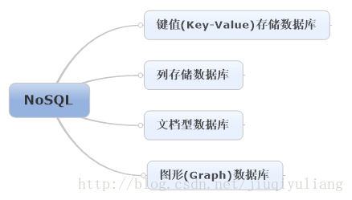

<!--
 * @Author: WeiShan
 * @Date: 2023-07-14 14:11:10
 * @LastEditors: WeiShan
 * @LastEditTime: 2023-07-14 14:13:56
 * @FilePath: \knowledge-book\pages\backend\database\NOSQL.md
 * @Description: 
 * 
 * Copyright (c) 2023 by WeiShan/xls, All Rights Reserved. 
-->
# NOSQL #

## 概念 ##
NoSQL（NoSQL=Not Only SQL），意即“不仅仅是SQL”。

## 发展 ##
NoSQL快速发展 
&nbsp;&nbsp;&nbsp;&nbsp;<a style = "color:red;">关键原因是：传统关系型数据库遇到了性能瓶颈</a> 
&nbsp;&nbsp;&nbsp;&nbsp;**高并发读写**、**对海量数据的高效率存储** 和访问以及对数据库的**高可扩展性和高可用性**成了关系型数据库难以逾越的鸿沟，关系型数据库应对这三大问题显得力不从心，暴露了很多难以克服的问题，例如：

 1、High performance - 对数据库高并发读写的需求  
web2.0网站要根据用户个性化信息来实时生成动态页面和提供动态信息，所以基本上无法使用动态页面静态化技术，因此数据库并发负载非常高，往往要达到每秒上万次读写请求。关系数据库应付上万次SQL查询还勉强顶得住，但是应付上万次SQL写数据请求，硬盘IO就已经无法承受了。其实对于普通的BBS网站，往往也存在对高并发写请求的需求，例如像JavaEye网站的实时统计在线用户状态，记录热门帖子的点击次数，投票计数等，因此这是一个相当普遍的需求。

2、Huge Storage - 对海量数据的高效率存储和访问的需求  
类似Facebook，twitter，Friendfeed这样的SNS网站，每天用户产生海量的用户动态，以Friendfeed为例，一个月就达到了2.5亿条用户动态，对于关系数据库来说，在一张2.5亿条记录的表里面进行SQL查询，效率是极其低下乃至不可忍受的。再例如大型web网站的用户登录系统，例如腾讯，盛大，动辄数以亿计的帐号，关系数据库也很难应付。

3、High Scalability && High Availability- 对数据库的高可扩展性和高可用性的需求  
在基于web的架构当中，数据库是最难进行横向扩展的，当一个应用系统的用户量和访问量与日俱增的时候，你的数据库却没有办法像web server和app server那样简单的通过添加更多的硬件和服务节点来扩展性能和负载能力。对于很多需要提供24小时不间断服务的网站来说，对数据库系统进行升级和扩展是非常痛苦的事情，往往需要停机维护和数据迁移，为什么数据库不能通过不断的添加服务器节点来实现扩展呢？

在上面提到的“三高”需求面前，关系数据库遇到了难以克服的障碍，而对于web2.0网站来说，**关系数据库的很多主要特性**却往往无用武之地，例如： 

①.数据库事务一致性需求 
很多web实时系统并不要求严格的数据事务，对读一致性的要求很低，有些场合对写一致性要求也不高。

②.数据库的写实时性和读实时性需求 
很多web实时系统并不要求严格的数据库事务，对读一致性的要求很低，有些场合对写一致性要求也不高。因此数据库事务管理成了数据库高负载下一个沉重的负担。

③.对复杂的SQL查询，特别是多表关联查询的需求  
任何大数据量的web系统，都非常忌讳多个大表的关联查询，以及复杂的数据分析类型的复杂SQL报表查询，特别是SNS类型的网站，从需求以及产品设计角度，就避免了这种情况的产生。往往更多的只是单表的主键查询，以及单表的简单条件分页查询，SQL的功能被极大的弱化了。

因此，关系数据库在这些越来越多的应用场景下显得不那么合适了，为了解决这类问题的非关系数据库应运而生，现在这两年，各种各样非关系数据库，特别是键值数据库(Key-Value Store DB)风起云涌，多得让人眼花缭乱。下面，我们具体看一下它的分类：

## 特点 ##
https://blog.csdn.net/jiuqiyuliang/article/details/41879145