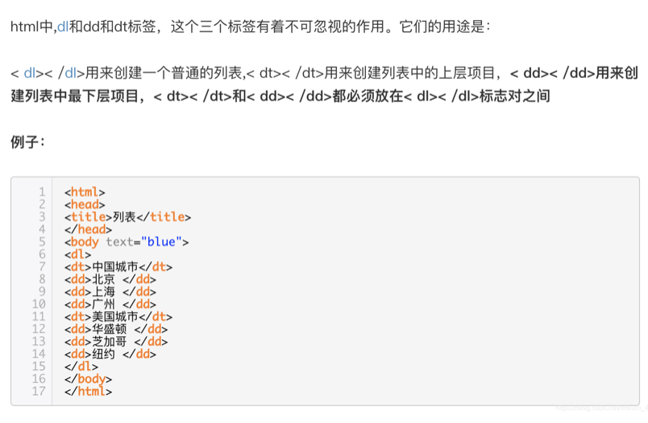
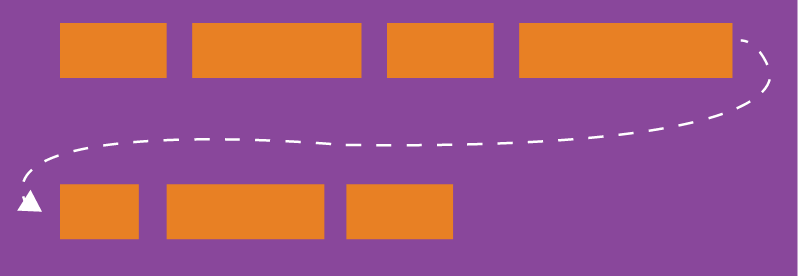
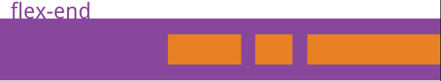
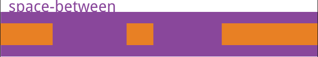

# CSS+HTML #

### 1.flex：1 ###

即为flex-grow：1，经常用作自适应布局，将父容器的display：flex，侧边栏大小固定后，将内容区flex：1，内容区则会自动放大占满剩余空间。

### 2.dl标签相关 ###

### 3.行内标签与块级标签 ###

	{/* 1.行级标签 */}

            {/* 1.1特点 */}
            {/* 可以和其他元素保持在同一行,不可以自动换行,但不能设置宽高
			行内标签（内联标签）不占有独立的区域，仅仅靠自身的字体大小和图像尺寸来支撑结构，一般不可以设置宽度，高度，对齐等属性，常用于控制页面中文本的样式
			 */}
			和相邻行内标签在一行上
			高、宽无效，但水平方向的padding，margin可以设置，垂直方向的无效
			行内标签只能容纳文本或者其他行内标签(a特殊 ，a标签里面可以放块级元素)

            {/* 1.2常见行级标签 */}
            
            
            <u></u> {/* 下划线 */}
            <em></em> {/* 强调 */}
            <i></i> {/* 斜体 */}
             {/* 下标 */}
             {/* 上标 */}

    {/* 2.块级标签 */}

            {/* 2.1特点 */}
            {/* 不可以和其他元素保持在同一行(独占一行)，可以自动换行，能设置宽高 */}

			总是从新行开始
			高度、行高、外边距以及内边距都可以控制
			宽度默认是容器的100%
			可以容纳内联标签和其他标签

            {/* 2.2常见块级标签 */}
            

            

            <h1-h6></h1-h6>
            <ul></ul>
            <li></li>
            <dl></dl> {/* 定义列表，跟ul...li类似 */}
            <dt></dt> {/* 定义列表中的项目 */}
            
    {/* 3.行内块级标签 */}

            {/* 3.1特点 */}
            {/* 可以和其他元素保持在一行，还能设置宽高 */}
			和相邻行内标签（或者行内块）在一行上，但是之间有空白缝隙
			默认宽度就是它本身内容的宽度
			块、行内标签转换为行内块：display:inline-block;

            {/* 3.2常见行内块级标签 */}
            <textarea name="" id="" cols="30" rows="10"></textarea>
            <input type="text" />
            
            <button></button>
## 3.弹性布局flex ##

任何一个容器都可以指定为Flex布局。

    .box{
      display: flex;
    }

行内元素也可以使用Flex布局。

	.box{
	  display: inline-flex;
	}

Webkit内核的浏览器，必须加上-webkit前缀。

	.box{
	  display: -webkit-flex; /* Safari */
	  display: flex;
	}

注意，设为Flex布局以后，**子元素的float、clear和vertical-align属性将失效**。

容器默认存在两根轴：水平的**主轴**（main axis）和垂直的**交叉轴**（cross axis）。主轴的开始位置（与边框的交叉点）叫做main start，结束位置叫做main end；交叉轴的开始位置叫做cross start，结束位置叫做cross end。

项目默认沿主轴排列。单个项目占据的主轴空间叫做**main size**，占据的交叉轴空间叫做**cross size**。

### 一.容器的属性 ###

- flex-direction
- flex-wrap
- flex-flow
- justify-content
- align-items
- align-content

#### 1.1.flex-direction属性 ####
flex-direction属性决定主轴的方向（即项目的排列方向）。

	.box {
	  flex-direction: row | row-reverse | column | column-reverse;
	}

它可能有4个值。

- row（默认值）：主轴为水平方向，起点在左端。
- row-reverse：主轴为水平方向，起点在右端。
- column：主轴为垂直方向，起点在上沿。
- column-reverse：主轴为垂直方向，起点在下沿。

#### 1.2.flex-wrap属性 ####
默认情况下，项目都排在一条线（又称”轴线”）上。flex-wrap属性定义，如果一条轴线排不下，如何换行。

	.box{
	  flex-wrap: nowrap | wrap | wrap-reverse;
	}

它可能取三个值。

（1）nowrap（默认）：不换行。

（2）wrap：换行，第一行在上方。

（3）wrap-reverse：换行，第一行在下方。

#### 1.3.flex-flow ####
flex-flow属性是flex-direction属性和flex-wrap属性的简写形式，默认值为row nowrap。

	.box {
	  flex-flow: <flex-direction> <flex-wrap>;
	}

#### 1.4.justify-content属性 ####
justify-content属性定义了项目在主轴上的对齐方式。

	.box {
	  justify-content: flex-start | flex-end | center | space-between | space-around;
	}

它可能取5个值，具体对齐方式与轴的方向有关。下面假设**主轴为从左到右**。

(1)flex-start（默认值）：左对齐

(2)flex-end：右对齐

(3)center： 居中

(4)space-between：两端对齐，项目之间的间隔都相等。

(5)space-around：每个项目两侧的间隔相等。所以，项目之间的间隔比项目与边框的间隔大一倍。

#### 1.5.align-items属性 ####
align-items属性定义项目在交叉轴上如何对齐。

	.box {
	  align-items: flex-start | flex-end | center | baseline | stretch;
	}

它可能取5个值。具体的对齐方式与交叉轴的方向有关，下面假设交叉轴从上到下。

- flex-start：交叉轴的起点对齐。
- flex-end：交叉轴的终点对齐。
- center：交叉轴的中点对齐。
- baseline: 项目的第一行文字的基线对齐。
- stretch（默认值）：如果项目未设置高度或设为auto，将占满整个容器的高度。

#### 1.6.align-content属性 ####
align-content属性定义了多根轴线的对齐方式。如果项目只有一根轴线，该属性不起作用。

	.box {
	  align-content: flex-start | flex-end | center | space-between | space-around | stretch;
	}

该属性可能取6个值。

- flex-start：与交叉轴的起点对齐。
- flex-end：与交叉轴的终点对齐。
- center：与交叉轴的中点对齐。
- space-between：与交叉轴两端对齐，轴线之间的间隔平均分布。
- space-around：每根轴线两侧的间隔都相等。所以，轴线之间的间隔比轴线与边框的间隔大一倍。
- stretch（默认值）：轴线占满整个交叉轴。

### 二.项目的属性 ###
以下6个属性设置在项目上。

- order
- flex-grow
- flex-shrink
- flex-basis
- flex
- align-self

#### 2.1.order属性 ####

https://blog.csdn.net/m0_48958478/article/details/125508280

## 4. 事件冒泡与事件捕获（stopPropagation 与 preventDefault ？） ##

#### 事件是怎样流动的 ####
在说stopPropagation是什么之前，需要简单说一下浏览器中的事件分发[1]。所谓事件分发机制指的是事件是怎样在DOM树中传递的。这里不得不提一下浏览器的发展历史。

初，网络世界一片混沌，一个名叫Netscape的浏览器横空出世，成为了网络世界早期真正意义上的领航者。Netscape为浏览器的发展做出了很多贡献，其很多功能后来成为了浏览器的标准。其中就包括本文所要探讨的事件模型。

对于事件传递机制，Netscape给出了自己的答案，从上往下传，即一个事件发生之后，会从文档的根一直传递到目标元素，也就是window -> document -> html -> body -> ... -> target 的传递方向。这种传递模型，也就是现在所谓的事件捕获。

有利益的地方就会有竞争。为了争夺浏览器份额，微软也开始着手浏览器的开发，推出了Netscape的最大竞争对手，IE浏览器。或许是为了显得与Netscape不一样，又或许是微软有自己的考虑，在事件传递机制上，微软的答案与Netscape截然相反，从下往上传，即一个事件发生之后，会从目标元素向上传递，一直传递的根元素，也就是 target -> parent -> ... -> body -> html -> document -> window 的传递方向。这种传递模型，也就是现在的事件冒泡。

对于攻城略地阶段的浏览器厂家来说，标准不统一还可以接受，但却苦了一众开发者。后来，Netscape日渐式微，IE独领风骚，w3c开始收拾这种混乱的局面，为事件传递机制定了一个统一的标准，浏览器既要实现事件捕获，也要实现事件冒泡。其实w3c制定这种标准也是不得已而为之，是一种兼容原Netscape页面的举动，毕竟，尽管Netscape倒了，Netscape里运行的页面还在，开发者还在。这一标准也就慢慢发展成了现在浏览器的通用标准。

#### 事件流动模型 ####
既然w3c制定了标准，那么正常情况下，事件的传递方向就已经是固定的了，即window -> document -> html -> body -> ... -> target -> ... -> body -> html -> document -> window的一个循环。按照这种逻辑，我们每设置一个监听器，在一次事件传递过程中，都将被触发两次，但事实真的如此吗？我们看下面的代码。

	<html>
	  <head></head>
	  <body>
	    

	      

	        
C

	      

	    

	  </body>
	</html>
	
按照上面的推测，我们点击C元素时，事件的流动如下（为简化，去掉了无关元素）:

	爷爷 -> 父亲 -> 儿子 -> 父亲 -> 爷爷
	
	那么理应的输出也应该是
	
	'clicked 爷爷'
	'clicked 父亲'
	'clicked 儿子'
	'clicked 父亲'
	'clicked 爷爷'
	可是实际运行一下，我们得到的却是
	
	'clicked 儿子'
	'clicked 父亲'
	'clicked 爷爷'

发生了什么？细心的同学可能已经发现了，捕获阶段的事件似乎没有被触发。没错，正是如此。答案就隐藏在addEventListener[2]这个方法中。

简单的来说，该方法还支持第三个参数，可以是一个对象或者boolean值，当为boolean值时，该方法的签名为

target.addEventListener(type, listener, useCapture);
当useCapture=true时，意味着事件监听器将在捕获阶段被触发，而useCapture=false时，事件监听器将在冒泡阶段触发。useCapture默认为false。

了解了这一点，再回头看前面的输出，答案就一目了然。我们所写的监听器默认是冒泡阶段触发，所以在捕获阶段的事件没有触发监听器。

如此，我们改一下监听器的触发时机，将其设为捕获阶段触发

	document.getElementById('爷爷').addEventListener('click', (e) => {
	  console.log('clicked 爷爷')
	}, true)
	
	document.getElementById('父亲').addEventListener('click', (e) => {
	  console.log('clicked 父亲')
	}, true)
	
	document.getElementById('儿子').addEventListener('click', (e) => {
	  console.log('clicked 儿子');
	}, true);
	
	--------------output--------------
	clicked 爷爷
	clicked 父亲
	clicked 儿子
正如我们预期的按照捕获阶段的流动顺序输出了。如果想要监听到全阶段的事件传递，也很简单，只需在捕获阶段和冒泡阶段分别监听即可。

	// 捕获阶段
	document.getElementById('爷爷').addEventListener('click', (e) => {
	  console.log('clicked 爷爷');
	}, true)
	document.getElementById('父亲').addEventListener('click', (e) => {
	  console.log('clicked 父亲')
	}, true)
	document.getElementById('儿子').addEventListener('click', (e) => {
	  console.log('clicked 儿子');
	}, true);
	
	// 冒泡阶段
	document.getElementById('儿子').addEventListener('click', (e) => {
	  console.log('clicked 儿子');
	});
	document.getElementById('父亲').addEventListener('click', (e) => {
	  console.log('clicked 父亲')
	})
	document.getElementById('爷爷').addEventListener('click', (e) => {
	  console.log('clicked 爷爷');
	})
	
	--------------output--------------
	clicked 爷爷
	clicked 父亲
	clicked 儿子
	clicked 儿子
	clicked 父亲
	clicked 爷爷

至此，我们对事件的流动与addEventListener的具体作用有了一个清晰的了解，只有了解这些，我们才能真正明白stopPropagation的作用。

stopPropagation究竟是干嘛用的
明白了事件传递机制之后，我们就可以来探讨一下stopPropagation了。

stopPropagation，顾名思义，是用来阻止事件传递的。那么，stopPropagation阻止的究竟是捕获阶段的传递还是冒泡阶段的传递呢？

答案就是：阻止的是整个事件传递过程中，该节点之后的事件传递。也就是说，stopPropagation阻止的并不单单是捕获阶段或者冒泡阶段，它针对的是整个事件传递过程，即包括了事件捕获以及事件冒泡。

依然是上面的代码，我们在捕获阶段调用stopPropagation。

	// 捕获阶段
	    document.getElementById('爷爷').addEventListener('click', (e) => {
	        console.log('clicked 爷爷');
	        e.stopPropagation();
	    }, true)
	    document.getElementById('父亲').addEventListener('click', (e) => {
	        console.log('clicked 父亲')
	    }, true)
	    document.getElementById('儿子').addEventListener('click', (e) => {
	        console.log('clicked 儿子');
	    }, true);
	    // 冒泡阶段
	    document.getElementById('儿子').addEventListener('click', (e) => {
	        console.log('clicked 儿子');
	    });
	    document.getElementById('父亲').addEventListener('click', (e) => {
	        console.log('clicked 父亲')
	    })
	    document.getElementById('爷爷').addEventListener('click', (e) => {
	        console.log('clicked 爷爷');
	    })
	
	--------------output--------------
	clicked 爷爷
可以看到，在捕获阶段，事件传递到爷爷节点时，由于调用了stopPropagation，事件就此中断，接下来的监听器以及冒泡阶段的监听器都不会再触发。因此输出只输出了‘爷爷’。

同样的，在冒泡阶段调用stopPropagation。

	// 捕获阶段
	    document.getElementById('爷爷').addEventListener('click', (e) => {
	        console.log('clicked 爷爷');
	    }, true)
	    document.getElementById('父亲').addEventListener('click', (e) => {
	        console.log('clicked 父亲')
	    }, true)
	    document.getElementById('儿子').addEventListener('click', (e) => {
	        console.log('clicked 儿子');
	    }, true);
	    // 冒泡阶段
	    document.getElementById('儿子').addEventListener('click', (e) => {
	        console.log('clicked 儿子');
	    });
	    document.getElementById('父亲').addEventListener('click', (e) => {
	        console.log('clicked 父亲');
	        e.stopPropagation();
	    })
	    document.getElementById('爷爷').addEventListener('click', (e) => {
	        console.log('clicked 爷爷');
	    })
	
	--------------output--------------
	clicked 爷爷
	clicked 父亲
	clicked 儿子
	clicked 儿子
	clicked 父亲

捕获阶段的事件顺利的接收到了，只有爷爷节点的事件没有传递到，符合预期。

至此，我们对事件传递相关的机制有了更深的了解，也对stopPropagation的真正作用有了直观印象。但是事情还没有完，还记得stopPropagation的好伙伴吗，没错，就是preventDefault。它究竟又是干嘛的呢？

preventDefault与stopPropagation有什么相关性吗
答案是没有。

很多人总是一起使用这两个方法，糊里糊涂的认为这两个方法必定有什么关联性。实际上preventDefault与stopPropagation描述的是完全不同的两种行为，他们之间的区别比java与javascript之间的区别还要大。

stopPropagation如之前所述，作用是阻止事件传递。而preventDefault的作用则是阻止默认行为。

那么什么叫默认行为？

实际上，用语言精确的描述默认行为是一件很难的事情，不像事件模型那样，默认行为这个概念不够精准，它更偏向于人类日常交流的思维。比如一个a标签，带有一个href属性，点击之后会跳转到该href对应的网址，这就是a标签的**默认行为**。

方便描述，我们可以用“**Element + Event = Action**”的格式描述**默认行为**。而preventDefault的作用就是**阻止这种Event所触发**的“**Action**”。

对于a标签来说，可以描述为“a元素 + click事件 = 跳转”。preventDefault之后就成了“a元素 + click事件 = void”。跳转行为被阻止了，因此无法正常的跳转到对应的网址。

默认行为非常之多，不同的元素对应不同的默认行为。比如：

"input + keypress = 输入"，preventDefault之后，按下键盘则无法在input里输入。

"document + contextmenu = 弹出右键菜单"，preventDefault之后，将无法再使用右键弹出菜单。

...

总之，默认行为是一个很杂的事情，不需要一一记住，只要了解了preventDefault的真正作用，在写一些代码的时候才会如鱼得水，细节了然于胸，对出现的一些问题也会不再迷茫。

今天从事件模型机制与函数api上探索了事件流动相关的知识，顺便介绍了preventDefault这个方法的真正含义。这些方法平时广泛被使用，却很少有人真正接触其原理。工作并不一定是一件让人愉悦的事情，但平时的积累最终会沉淀为自己内在的高度。多总结，多思考，知其然，更要知其所以然，在前端这个行业，也在自己的人生道路上，走的越来越远吧。