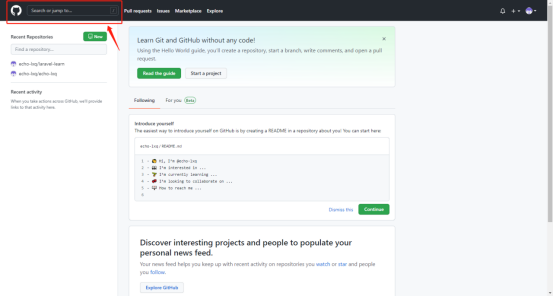
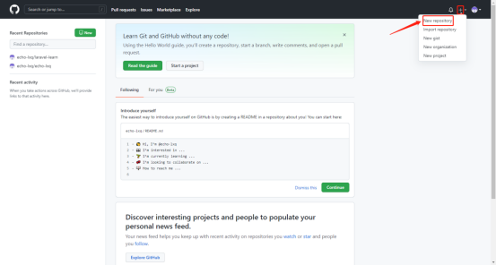
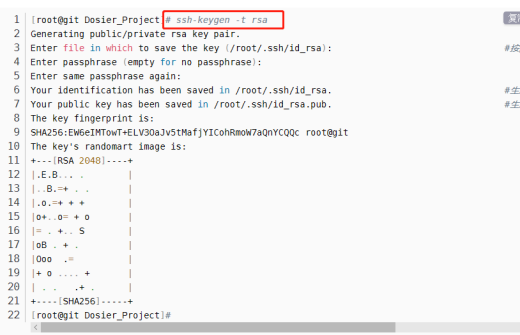
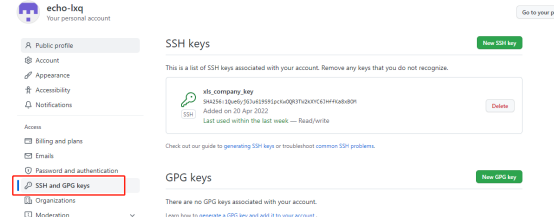
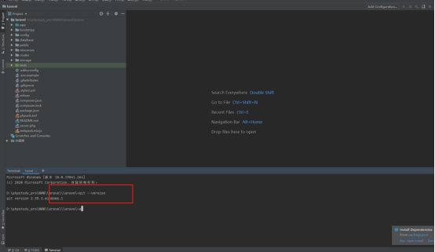

# GIT #
## 一、Github使用 ##

1. 访问github官网 https://github.com/ 注册账号并登陆
1. 若访问或下载的时候慢打不开使用vpn (插件2有免费节点)
1. 搜索资源(https://blog.csdn.net/luanfenlian0992/article/details/105684367)

*常用的搜索命令：* 
①.直接搜索需要找的资源名称 
②.在开源项目的名称中去搜索 -- <a style="color:red">**in:name XXX**</a> 
③.再进一步，通过项目的stars数来缩小搜索范围 --  
<a style="color:red">**in:name XXX stars:>数字** </a>  
④.在项目的 README 即详细介绍中搜索关键字 -- 
<a style="color:red">**in:readme XXX(stars:>数字 forks:>数字)**</a> 
⑤.在描述(description：)中搜索关键字,同时限定使用的语言（language：） 
<a style="color:red">**in:description XXX language:XXX ** </a>
⑥.搜索范围加上项目更新的时间 
<a style="color:red">**in:description XXX language:XXX pushed:>时间**</a>

**4.新建仓库**

## 二、Git使用 ##
1.**git下载 https://git-scm.com/downloads**

**2.免密链接远程仓库**

①.生成秘钥  -- 命令之后三次enter

②.去对应文件夹复制秘钥后粘贴到github  setting > ssh and GPG keys

**3.安装时候可以选择编辑器**

**4.使用**

①.不在编辑器内使用:找到对应的文件夹然后右击git bush here 
设置配置文件   

    - 用户名 git config --global user.name "echo-lxq"
    - 邮箱地址 git config --global user.email echo_lxq@163.com
    - 默认分支  git config --global init.defaultBranch main
    - 解决windows下使用与linux换行区别导致代码导入导出有问题
    -git config --global core.autocrlf false  
&nbsp;&nbsp;&nbsp;&nbsp;core.autocrlf是git中负责处理line ending的变量，可以设置3个值：true，false，inout  1.当设置成false时，line endings将不做转换操作。文本文件保持原来的样子。2.设置为input时，添加文件git仓库时，git把crlf(回车换行)编程lf(换行)。当有人Check代码时还是lf方式。因此在window操作系统下，不要使用这个设置； 3.当设置成true时，这意味着你在任何时候添加(add)文件到git仓库时，git都会视为它是一个文本文件(text file)。它将把crlf变成LF。

    -git config --global core.safecrlf true 
    git config --global core.safecrlf true #拒绝提交包含混合换行符的文件
    git config --global core.safecrlf false #允许提交包含混合换行符的文件
    git config --global core.safecrlf warn #提交包含混合换行符的文件时给出警告
**PS.windows : CRLF( 回车换行 \r\n )  
	 Linux/Unix: LF (换行 \n)  
	 Mac: LF(现在是换行, 以前是回车( Classic Mac )CR, \r ) **

    初始化 - git init
    克隆仓库 - git clone [url] [folder]
    更新仓库内容 
    - git add -u 将项目中修改的部分放到缓存区  
    -git add . 将当前文件夹内所有内容
    -git commit -m [description] 设置本地提交备注
    -git remote add [name] [address] 将git address命名为name
    -git push [name] [origin] 提交更新 后面的是选择远程仓库的分支
     
②.在编辑器内使用 -- 直接输入对应命令行即可

**5.分支合并问题与使用的基本思路**

假设有两个分支 A 、B

A 分支需要合并 B 分支新开发的代码

目前常见的主要有两种合并方式

**整体合并：**首先切换到A分支，

（1）执行命令：git branch -a 查看当前所有分支。

执行结果：

结果分析：白色代表本地已有分支；绿色代表本地正在使用的分支；红色代表远程所有分支；

（2）执行切换分支命令：git checkout A ，切换到分支A；

（3）执行命令：git pull ，更新代码到最新；

（4）执行命令：git merge B, 此命令的作用就是合并分支 B 上边的全量代码到分支 A；

（5）切换回分支A：git checkout A

（6）用开发工具打开查看合并后分支A的代码，有冲突则解决。

**部分合并：**首先切换到A分支，

（1）执行命令：git branch -a 查看当前所有分支。

执行结果：

结果分析：白色代表本地已有分支；绿色代表本地正在使用的分支；红色代表远程所有分支；

（2）执行切换分支命令：git checkout A ，切换到分支A；

（3）执行命令：git pull ，更新代码到最新；

（4）执行命令：git checkout B, 切换到分支 B；

（5）查看分支 B 的提交记录,执行命令：git log 

   执行结果：

  根据上述的执行结果，我们可以看到B分支的提交记录，我们选择想要合并的某一个提交记录所涉及到的内容。假设我们要合      并 配置 swagger 的内容，我们拿到上述截图中的对应的 commitid ：9af181504738a9cc52248dc2c09c19394cd480b8

（5）切换回分支A：git checkout A

（6）合并 B 分支 commitid 为 9af181504738a9cc52248dc2c09c19394cd480b8 的内容，

  执行命令 ：git cherry-pick 9af181504738a9cc52248dc2c09c19394cd480b8 。

（7）执行命令：git push 。将合并后的内容提交到远程仓库

三、遇到的问题及解决方法

<a style="color:red;">error: Your local changes to the following files would be overwritten by merge</a>

**解决方案 **
根据是否要保存本地修改，有以下两种解决方案

①.保留修改 
执行以下三条命令

	git stash #封存修改
	git pull origin master 
	git stash pop #把修改还原
注： 
**git stash：**备份当前工作区内容，从最近的一次提交中读取相关内容，让工作区保证和上次提交的内容一致。同时，将当前工作区内容保存到Git栈中 
**git pull：**拉取服务器上当前分支代码 
**git stash pop：**从Git栈中读取最近一次保存的内容，恢复工作区相关内容。同时，用户可能进行多次stash操作，需要保证后stash的最先被取到，所以用栈（先进后出）来管理；pop取栈顶的内容并恢复 
**git stash list：**显示Git栈内的所有备份，可以利用这个列表来决定从那个地方恢复。 
**git stash clear：**清空Git栈 

②.废弃修改 
核心思想就是版本回退，具体命令如下

    git reset --hard 
    git pull origin master
注：不建议使用第二种。除非你再三确定不需要本地的修改了。