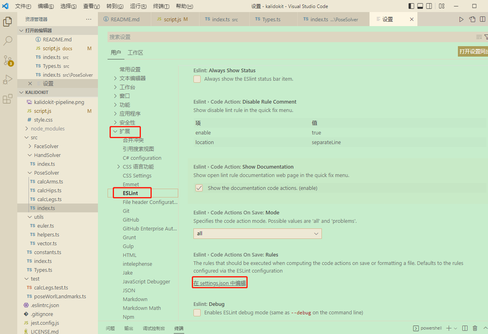

# VSCODE配置 #

## 一、颜色及代码配置 ##
>1 vscode主题选择为 Solarized Light
> 
>2 自定义颜色部分(setting.json)

	"workbench.colorTheme": "Solarized Light",
	"workbench.colorCustomizations": {
            "editor.selectionBackground": "#e41fda7e",   //选中高亮
            "editor.background": "#C7EDCC",           //背景颜色
        },
        "editor.tokenColorCustomizations":{
            "comments": "#9ea023da",      //注释
            "keywords": "#0a0",             // 关键字
            "variables": "#f00",            // 变量名
            "strings": "#18170fbd",         // 字符串
            "functions": "#5b99fcc9",   // 函数名
            "numbers": "#AE81FF"            // 数字
        },

>3 自定义字体大小与取消逗号补全关键字
    
    "ecitor.fontsize":16,
    "editor.acceptSuggestionOnCommitCharacter": false,

## 二、html快捷键配置 ##
### 1.快速生成标签 ###
> 打开配置文件添加如下配置

	"emmet.triggerExpansionOnTab": true,
	    "emmet.showAbbreviationSuggestions": true,
	    "emmet.showExpandedAbbreviation": "always",
	    "emmet.includeLanguages": {
	        "javascript": "html"
	}

## 三、JS快捷键配置 ##
### 1.快速头注释 ###
- 安装 koroFileHeader
- 配置 setting.json
- 在VS Code中，依次打开 “文件(File) → 首选项(Preferences) → 设置(Settings)”,然后搜索fileheader以打开setting.json文件
- 最后在setting.json中添加如下配置命令：（配置命令可自定义修改哈，详细配置见GitHub：koroFileHeader）

    	// 头部注释
	    "fileheader.customMade": {  //快捷键 ctrl+win+i
	    "Author": "Xminyang", // 创建文件的作者
	    "Date": "Do not edit", // 文件创建时间(不变)
	    "LastEditors": "Xminyang", // 文件最后编辑者
	    // 由于编辑文件就会变更最后编辑时间，多人协作中合并的时候会导致merge
	    // 可以将时间颗粒度改为周、或者月，这样冲突就减少很多。搜索变更时间格式: dateFormat
	    "LastEditTime": "Do not edit", // 文件最后编辑时间
	    // 输出相对路径，类似: /文件夹名称/src/index.js
	    "FilePath": "Do not edit", // 文件在项目中的相对路径 自动更新
	    // 插件会自动将光标移动到Description选项中 方便输入 Description字段可以在specialOptions更改
	    "Description": "", // 介绍文件的作用、文件的入参、出参。
	    // custom_string_obkoro1~custom_string_obkoro100都可以输出自定义信息
	    // 可以设置多条自定义信息 设置个性签名、留下QQ、微信联系方式、输入空行等
	    "custom_string_obkoro1": "",
	    // 版权声明 保留文件所有权利 自动替换年份
	    "custom_string_obkoro1_copyright": "Copyright (c) ${now_year} by 用户/公司名, All Rights Reserved. "
	    },
	    // 函数注释
	    "fileheader.cursorMode": {//快捷键 ctrl+win+t
	    "description": "", // 函数注释生成之后，光标移动到这里
	    "param": "", // param 开启函数参数自动提取 需要将光标放在函数行或者函数上方的空白行
	    "return": "",
	    }

## 四、react配置 ##

### 1.快捷键插件配置 ###

> 组件名 - VS Code ES7 React/Redux/React-Native/JS snippets
> 
> 快捷键 - 输入rcc + 回车  =  生成类组件必要代码

## 五、代码语法规则配置-ESlint ##

> 1.插件安装 ESLint
> 
> 2.插件扩展配置

添加如下配置：

	"editor.codeActionsOnSave": {
        "source.fixAll.eslint":true 
    },

> 3.配置 eslint 进行格式化
> 
由于安装最新的 create-react-app 结合 VScode 编辑器即可支持 eslit，但是需要在项目根目录中要添加 .env 这个配置文件，设置 EXTEND_ESLINT=true 这样才会启用 eslint 检测，注意要 重启 vscode

